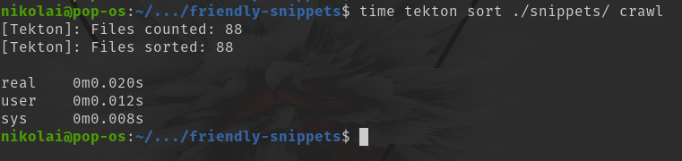

# Tekton

Author(s): Nicholas O'Kelley

Date: 2022-08-28

Last Modified: 2022-12-25

NOTE: This is still a tool in alpha and might rapidly change.

## Motivation

I needed a tool to speed up the time I spent reviewing snippets on the [`friendly-snippet`](https://github.com/rafamadriz/friendly-snippets) project.

The goals of such a tool are:

- Sort many files **blazingly fast** 
- Sort alphabetically
- Ideally convert between snipmate and friendly-snippets (json) formats

## Installation and Execution

- `cargo install tekton`

To convert: 

- `tekton convert <INPUT_FILENAME> <OUTPUT_FILENAME>`

The current mappings support bidirectional conversion between Snipmate (`.snippet`) and JSON

To sort: 
- `tekton sort <INPUT_FILENAME> [crawl]`

Note: If anything appears after the `<INPUT_FILENAME>` the program assumes the user wants to crawl directories for files.

## Current Limitations

- The conversion doesn't process in large batches of files like the sort. This is intentional as conversions between formats should be isolated and limited in scope.

## Acknowledgements

- My impatience for doing this by hand 
- A desire to automate everything

## Demo

### Sorting Speeds

