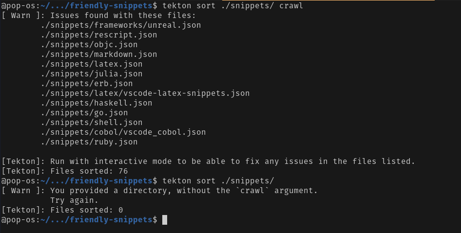

# tekton   [![Latest Version]][crates.io] ![Workflow]

[Workflow]: https://github.com/OkelleyDevelopment/tekton/actions/workflows/ci.yml/badge.svg
[Latest Version]: https://img.shields.io/crates/v/tekton.svg
[crates.io]: https://crates.io/crates/tekton

Author(s): Nicholas O'Kelley

Date started: 2022-08-28

NOTE: This is still a tool in 'alpha' and might rapidly change, though notice will be made if that happens.

## Motivation

I needed a tool to speed up the time I spent reviewing snippets on the [`friendly-snippet`](https://github.com/rafamadriz/friendly-snippets) project.

The goals of such a tool are:

- Sort many files **blazingly fast** 
- (Ideally) Sort alphabetically **blazingly fast**
- Convert between snipmate and friendly-snippets (json) formats **blazingly** ... **fast**

## Installation and Usage

- `cargo install tekton`

### Usage

To convert: 

- `tekton convert <INPUT_FILENAME> <OUTPUT_FILENAME>`

> Note: 
> - Conversion supports bidirectional conversion between Snipmate (`*.snippet`) and JSON snippets
> - Mapping is based on the input file

To sort: 
- `tekton sort <INPUT_FILENAME> [crawl] [INTERACTIVE]`

> Note: 
> - If anything appears after the `<INPUT_FILENAME>` the program assumes the user wants to crawl directories for files.
> - The interactive option allows the user to potentially correct any errors that arise. Leaving  this off will simply mean an error report is displayed on screen

## Current Limitations

1. The conversion doesn't process in large batches of files like the sort. This is intentional as conversions between formats should be isolated and limited in scope.
2. Snippet files with an array in the `prefix` field (even if it is just one) will convert all the snippets in the file to have that same array 
    - From testing, this doesn't seem to impact performance at all in terms of the user of the snippet file

## Acknowledgements

- My impatience for doing this by hand 

## Demos

### Conversion

### Sorting

