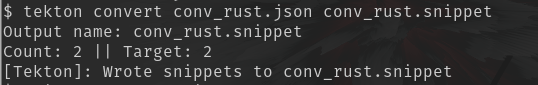
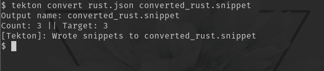
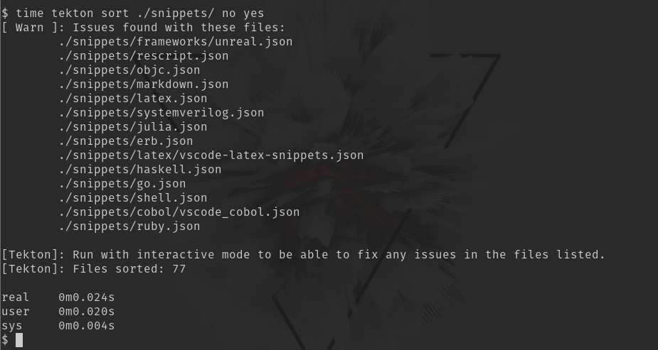

# tekton [![Latest Version]][crates.io] ![Workflow] ![Rustc Version 1.66+]

---

[workflow]: https://github.com/OkelleyDevelopment/tekton/actions/workflows/ci.yml/badge.svg
[latest version]: https://img.shields.io/crates/v/tekton.svg
[crates.io]: https://crates.io/crates/tekton
[rustc version 1.66+]: https://img.shields.io/badge/rustc-1.66+-blue.svg

Author(s): Nicholas O'Kelley

Date started: 2022-08-28

**Note**: The code on the repo represents the work done for `v0.2.0` which will be published to crates.io soon.

## Motivation

I needed a tool to speed up the time I spent reviewing snippets on the [`friendly-snippet`](https://github.com/rafamadriz/friendly-snippets) project.

The goals of such a tool are:

- Sort many files **blazingly fast**
- (Ideally) Sort alphabetically **blazingly fast**
- Convert between snipmate and friendly-snippets (json) formats **blazingly** ... **fast**

---

## Installation and Usage

### For published versions

- `cargo install tekton`

### For source builds

From the project root:

- `cargo install --path ./`

### Usage

**To convert**:

- `tekton convert <INPUT_FILENAME> <OUTPUT_FILENAME>`

> Note:
>
> - Conversion supports bidirectional conversion between Snipmate (`*.snippet`) and JSON (`*.json`) snippets
> - Mapping is based on the input file

**To sort**:

- General format: `tekton sort <INPUT_FILENAME> [INTERACTIVE] [CRAWL]`
  - To sort a single file
    - `tekton sort <INPUT_NAME>`
  - To sort a directory: `tekton sort <INPUT_NAME> no true`

> Note:
>
> - `INTERACTIVE` should be the string `yes` if the user wants to fix any errors during the sort.
>
>   - Leaving this off will simply mean an error report is displayed on screen
>
> - `CRAWL` must be present to recursively walk the directories for snippets
>   - Any text present will result in a crawl, though `true` looks better.

---

## Demos

- Conversion from Snipmate to `JSON`

- Conversion from the `JSON` snippets to Snipmate

- Sorting `friendly-snippets`, **blazingly fast** , with interactive mode off and directory crawling on.

---

## Current Limitations

1. The conversion doesn't process in large batches of files like the sort. This is intentional as conversions between formats should be isolated and limited in scope.
   - This can be automated via other scripting means (Rust, Go, Python, etc).
2. Snippet files with an array in the `prefix` field (even if it is just one) will convert all the snippets in the file to then have their snippets inserted into an array too.

   - **Note**: I am working on writing a custom `Serialize` and `Deserialize` implementation to handle clean up the serialization for one element.

3. Currently do not sort Snipmate snippets.
   - This one will more than likely be the next thing I add

---

## Acknowledgements

- My impatience for doing this by hand
